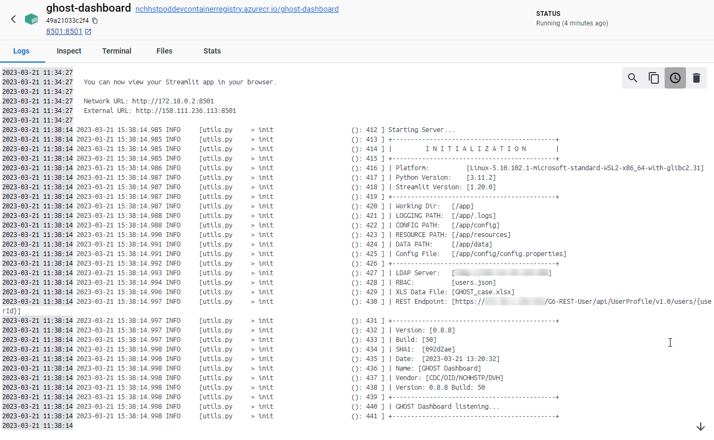

# GHOST Dashboard

Install and Configure some type of Python environment like Anaconda. Once installed you can configure the work space to run Streamlit
Additional dependencies required:

- ```pip install -r requirements.txt```

Run using a Streamlit environment:

- ```streamlit run dashboard.py``` this should open a new tab on your browser with the application running.

**Running on Windows**

**NOTE:** The application uses a simple authentication using Active Directory via LDAP. You will need access to AD or simply comment out the AD authentication part of the code.

- **Python** needs to be installed and configured.
- ```win-env.cmd``` needs to to have the **{VALUE-GOES-HERE}** replaced in order to be able to run the application. To Run type the following command  
- ```start.cmd``` to run the application locally  


**In Docker (Windows)**

- Docker Desktop should be running   
- Use ```build.cmd``` to create image to then run ```up.cmd``` with docker compose then go to [http://localhost:8501/](http://localhost:8501/ "http://localhost:8501/")
- To deploy image to Azure use ```deploy.cmd```

**Other Information**

- ```pip freeze``` includes more dependencies but appears to work better with Docker over 
- ```pipreqs``` when using git commands in the python code
- ```pip freeze > requirements.txt``` Include all Python requirements
- ```pipreqs --encoding utf-8 . --force```

**NOTE:** Try to avoid committing files with sensitive data and/or URLs

## Application Architecture
 

## Docker Desktop View



## Application View
